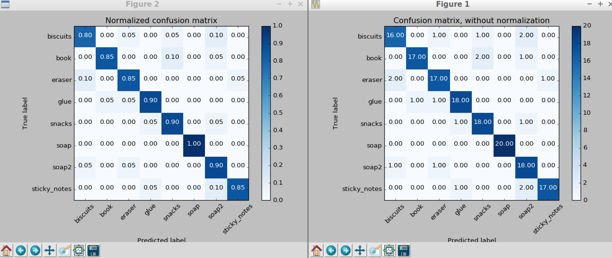

## Project: Perception Pick & Place

---

# Required Steps for a Passing Submission:
1. Extract features and train an SVM model on new objects.
2. Write a ROS node and subscribe to `/pr2/world/points` topic. 
3. Use filtering and RANSAC plane fitting to isolate the objects of interest from the rest of the scene.
4. Apply Euclidean clustering to create separate clusters for individual items.
5. Perform object recognition on these objects and assign them labels (markers in RViz).
6. Calculate the centroid (average in x, y and z) of the set of points belonging to that each object.
7. Create ROS messages containing the details of each object (name, pick_pose, etc.) and write these messages out to `.yaml` files, one for each of the 3 scenarios (`test1-3.world` in `/pr2_robot/worlds/`). 
8. Submit a link to your GitHub repo for the project or the Python code for your perception pipeline and your output.

## [Rubric](https://review.udacity.com/#!/rubrics/1067/view) Points
### Here I will consider the rubric points individually and describe how I addressed each point in my implementation.  

---
### Writeup / README

### Exercise 1, 2 and 3 pipeline implemented
#### 1. Complete Exercise 1 steps. Pipeline for filtering and RANSAC plane fitting implemented.

In the callback function, named as pcl_callback(located No.50 line in the project_template.py), I implemented the folllowing steps.

* Convert ROS message to PCL data by helper function (No.54 line in the project_template.py)
* Remove Outlier point cloud data by PCL’s StatisticalOutlierRemoval filter, which computes the distance to all of its neighbors, and then calculates a mean distance. By assuming a Gaussian distribution, the points outside of an interval defined by the distances mean+standard deviation are considered to be outliers and removed.(No.56-66 lines in the project_template.py)
* Downsample the point cloud data by Voxel Grid technique, with Leaf size at 0.01. (No.68-76 lines in the project_template.py)
* Set Passthrough filter align with Z axis and the range min 0.5 - max 1.1.(No.78-89 lines in the project_template.py)
* Use RANSAC segmentation with max distance = 0.03 to recognize objects and table separately. (No.91-107 lines in the project_template.py)

#### 2. Complete Exercise 2 steps: Pipeline including clustering for segmentation implemented.  

In addition to the Exercise 1 steps, I implemented pipeline as follows.

* Execute Eudlidean clustering with tolerance 0.020, cluster size range min 110 - max 1000, then search K-d tree. After extracting each cluster as each object, then assign differenct color. (No.113-142 lines in the project_template.py)
* Convert PCL data to ROS message and pubish. (No.144-152 lines in the project_template.py)

#### 2. Complete Exercise 3 Steps.  Features extracted and SVM trained.  Object recognition implemented.

In addition to the Exercise 1 & 2 steps, I implemented pipeline as follows.

* Convert PCL cluster data to ROS by helper function, then extract color & normal histogram features. After concatenate those features, used for SVM training. With the trained model, predict each object and set the result as label.(No.157-188 lines in the project_template.py)
* When training my SVM, I used HSV color, a

### Pick and Place Setup

#### 1. For all three tabletop setups (`test*.world`), perform object recognition, then read in respective pick list (`pick_list_*.yaml`). Next construct the messages that would comprise a valid `PickPlace` request output them to `.yaml` format.

* I called the function named as pr2_mover, to got parameters from ROS (object_list & dropbox), meanwhile I got each detected object list from the attribute in the function. After that I calculated centroids and set those to Pick_pose positions.
* Also, I selected right / left arm depending on the object group, and set the place_pose positions as well.
* Finally, I created the list of dictionalies to make the yaml file for submission. (No.284-311 lines in the project_template.py)

It seemed that the centroids and pick place positions were calculated well, because the arm could reach the objects well, but picking and dropping object failed. From the course instruction, I should try to implement collision detection.

